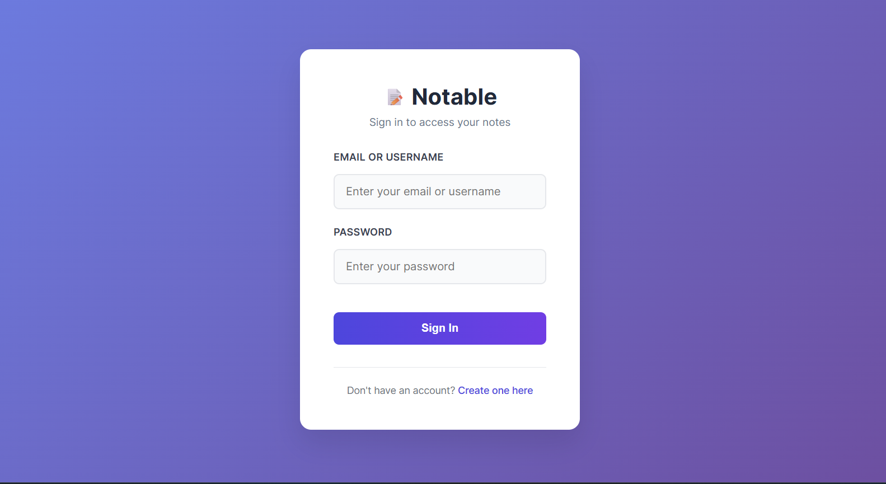
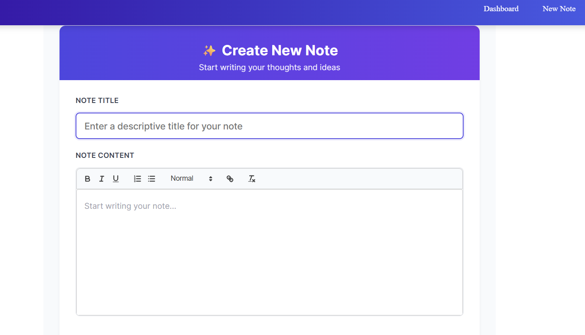

# 📝 Notable – Your Personal Note-Taking App

**Notable** is a simple, elegant, and efficient note-taking app built with a Flask backend and a React frontend. It lets users create, read, update, and delete notes, with JWT-based authentication to keep your data secure.

## 🚀 Features

- ✅ User Authentication (JWT-based)
- 📝 Create, Read, Update, and Delete Notes
- 🧠 Inline Editing for a Seamless Experience
- 🔒 Protected Routes and Secure API Access
- 🎨 Clean, Responsive UI
- 📅 Timestamps for Notes
- 🏷️ Tags and Filtering (Optional)
- 💬 Confirmation Modals for Safe Deletion
- 💡 "Empty State" Feedback When No Notes Exist

## 🛠️ Built With

**Frontend:**
- React (Vite)
- Axios
- React Router
- CSS 

**Backend:**
- Flask
- Flask-JWT-Extended
- SQLAlchemy
- PostgreSQL (hosted on Render)

**Deployment:**
- Frontend: [Vercel]
- Backend: Render

## 📸 Screenshots



## 📦 Getting Started

### 🔧 Backend Setup (Flask)

```bash
git clone https://github.com/yourusername/notable.git
cd notable/backend
python -m venv venv
source venv/bin/activate  # On Windows: venv\Scripts\activate
pip install -r requirements.txt
```

Create a .env file in the backend directory with the following:
```
SECRET_KEY=your_secret_key
JWT_SECRET_KEY=your_jwt_secret_key
DATABASE_URL=your_postgres_database_uri
```

Then run:
```
flask db upgrade
flask run
```

### Frontend Setup (React)
```
cd ../frontend
npm install
npm run dev
```

## 📄 License

This project is licensed under the MIT License.


## 👤 Author

**Melchizedek Maranga**  
- [kingzedek.com](https://kingzedek.com)  
- [GitHub: @melmuya](https://github.com/melmuya)  
- [LinkedIn: https://www.linkedin.com/in/melchizedek-maranga/]  

